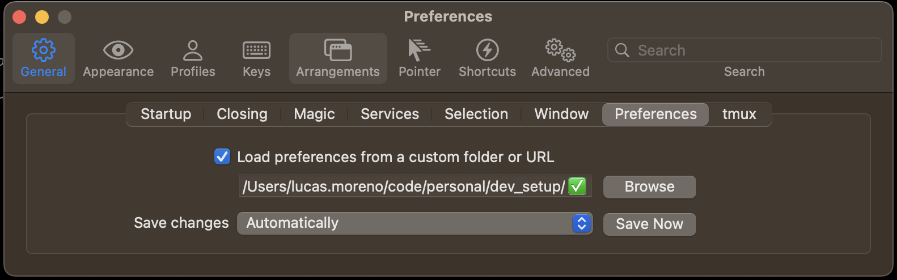
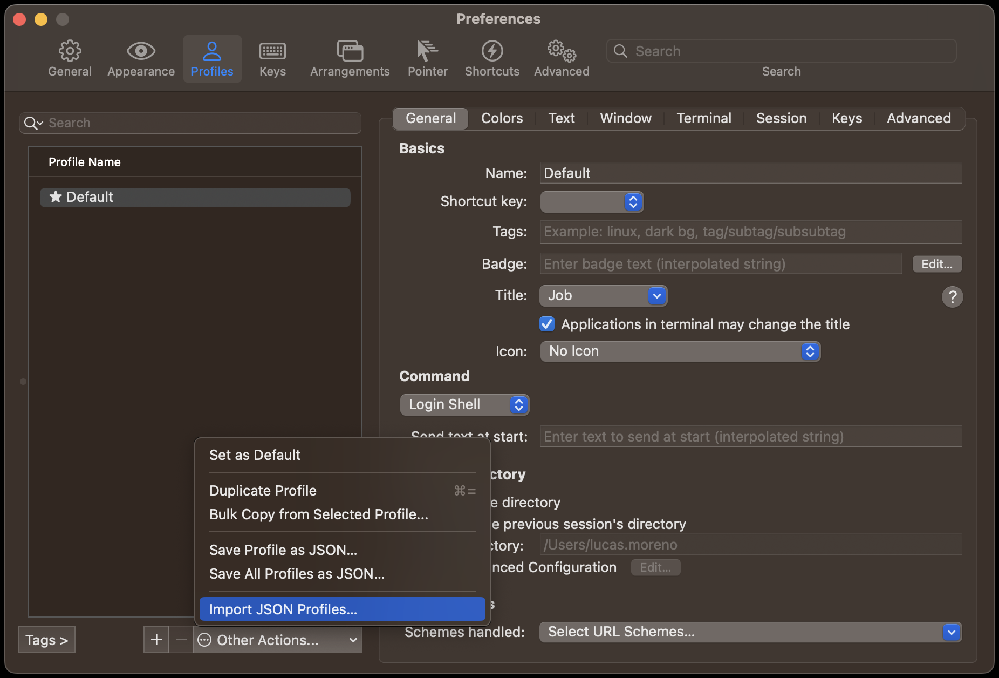
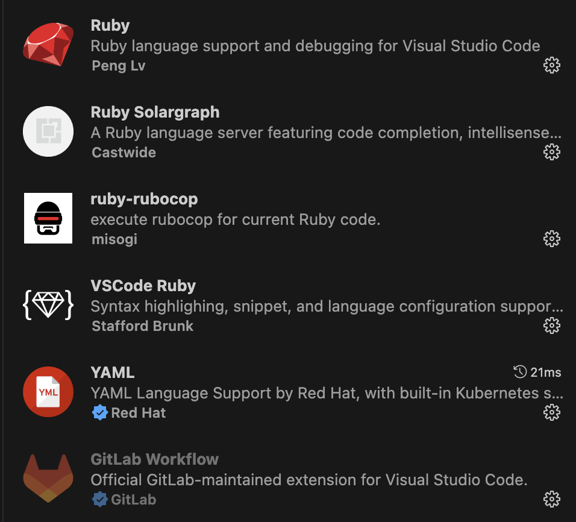
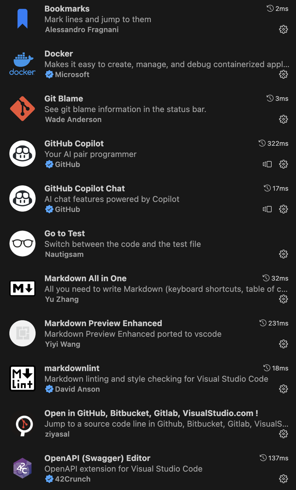

# Dev Setup

It describes a bunch of steps to setup nice tools to be used by a software engineer.

## Useful links

[Modern Unix tools](https://github.com/ibraheemdev/modern-unix)

## Step by step for basic

This sections describes how to install each tool individually.

### 1.[iTerm](https://iterm2.com/)

```shell
curl -o iterm.zip -L0 https://iterm2.com/downloads/stable/latest

mv iTerm.app /Applications/

open /Applications/iTerm.app
```





### 2.[oh-my-zsh](https://ohmyz.sh/)

```shell
sh -c "$(curl -fsSL https://raw.githubusercontent.com/ohmyzsh/ohmyzsh/master/tools/install.sh)"

echo "source ~/code/personal/dev_setup/config/zsh/aliases.sh" >> ~/.zshrc
```

### 3.[Homebrew](https://brew.sh/)

```shell
/bin/bash -c "$(curl -fsSL https://raw.githubusercontent.com/Homebrew/install/HEAD/install.sh)"

brew install docker docker-compose git-delta jq kubectx bat the_silver_searcher tldr httpie rectangle

mkdir -p ~/.config/httpie/
cp config/httpie/config.json ~/.config/httpie/
```

### 4.Git

```shell
ssh-keygen

cp config/git/.gitconfig ~/.gitconfig
```

## GUI Applications

1. [VSCode](https://code.visualstudio.com/download)
2. [Fork](https://fork.dev/)
3. [Todoist](https://todoist.com/)
4. [Dropbox](https://dropbox.com/)
5. [Nordpass](https://nordpass.com/)
6. [Typora](https://typora.io/)
7. [TablePlus](https://tableplus.com/)
8. [Google Chrome](https://www.google.com/chrome/)
9. [FireFox](https://firefox.com)
10. [Spotify](https://spotify.com)

### VSCode

1. Copy files from `config/vscode/`
2. Install plugins
    
    
